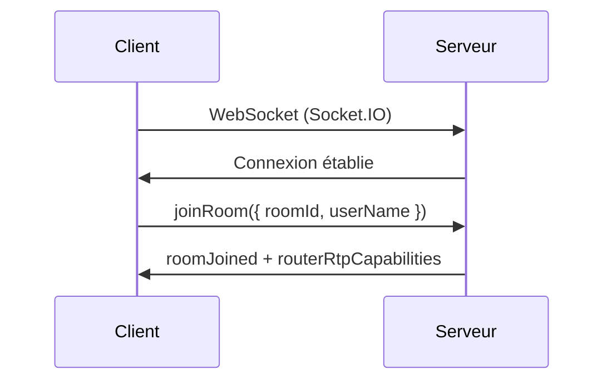
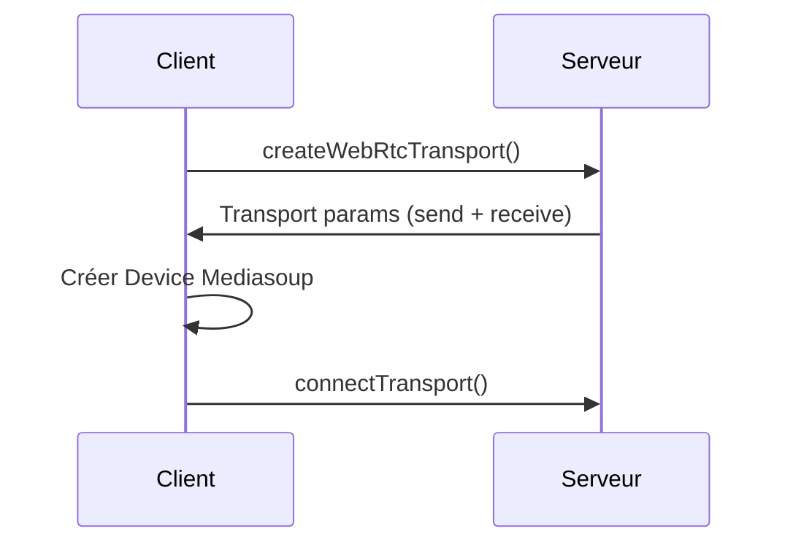
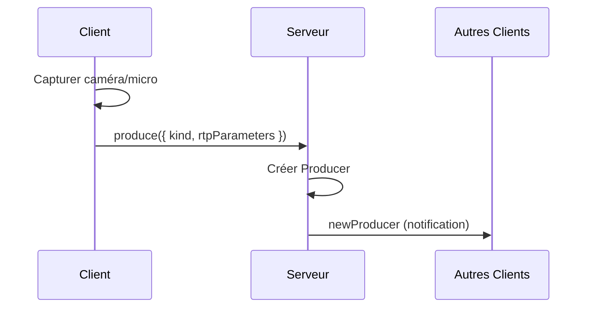
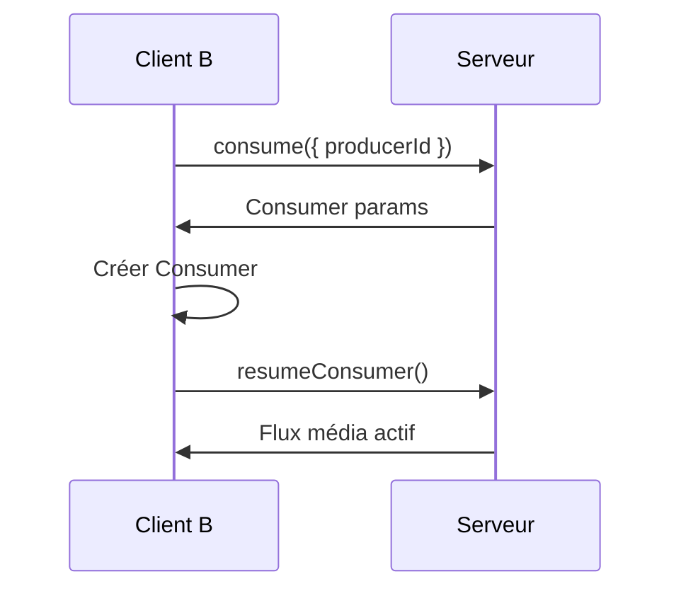

<div align="center">

# 🎥 LOCAL MEET

### Plateforme de visioconférence sécurisée pour réseau local

[](https://nextjs.org/)
[](https://react.dev/)
[](https://www.typescriptlang.org/)
[](https://mediasoup.org/)
[](https://socket.io/)
[](LICENSE)

[Démo Live](#) • [Documentation](#-documentation) • [Installation](#-installation-rapide) • [Contribuer](#-contribuer)


*Visioconférence premium pour réseau local - Gratuite, sécurisée et rapide*

</div>

---

## 📋 Table des matières

- [À propos](#-à-propos)
- [Démo Live](#-démo-live)
- [Fonctionnalités](#-fonctionnalités)
- [Architecture](#-architecture)
- [Stack Technique](#️-stack-technique)
- [Installation Rapide](#-installation-rapide)
- [Installation Détaillée](#-installation-détaillée)
- [Configuration](#️-configuration)
- [Utilisation](#-utilisation)
- [Structure du Projet](#-structure-du-projet)
- [API & WebSockets](#-api--websockets)
- [Sécurité](#-sécurité)
- [Performance](#-performance)
- [Dépannage](#-dépannage)
- [Contribuer](#-contribuer)
- [Roadmap](#-roadmap)
- [Licence](#-licence)
- [Support](#-support)

---

## 📖 À propos

**LOCAL MEET** est une solution de visioconférence professionnelle conçue pour fonctionner exclusivement sur votre réseau local. Contrairement aux solutions cloud (Zoom, Google Meet), vos données restent **100% privées** et ne quittent jamais votre réseau.

### 🎯 Pourquoi LOCAL MEET ?

- **🔒 Confidentialité totale** : Aucune donnée n'est envoyée vers des serveurs externes
- **⚡ Ultra-rapide** : Latence minimale grâce au réseau local
- **💰 Gratuit** : Pas d'abonnement, pas de limite de temps
- **🛡️ Sécurisé** : Chiffrement HTTPS + certificats SSL
- **🎨 Interface moderne** : Design inspiré de Google Meet
- **📱 Multi-plateforme** : Fonctionne sur ordinateur, tablette et smartphone

### 🏆 Cas d'usage

- Entreprises avec des besoins de confidentialité stricts
- Institutions gouvernementales et médicales
- Écoles et universités (réseau local)
- Événements et conférences sur site
- Développement et tests en local

---

## 🎬 Démo Live

> **Note** : La démo live n'est pas disponible publiquement car LOCAL MEET est conçu pour fonctionner sur réseau local uniquement.

### 📸 Captures d'écran

<div align="center">

#### Page d'accueil

*Interface moderne avec création et jointure de réunion*

#### Salle de réunion

*Grille vidéo adaptative avec contrôles intuitifs*

#### Partage d'écran

*Partage d'écran haute qualité avec miniatures des participants*

#### Interface mobile

*Design responsive pour smartphone et tablette*

</div>

### 🎥 Vidéo de démonstration

<!-- Ajoutez votre vidéo YouTube/Vimeo ici -->
[](https://youtube.com/watch?v=YOUR_VIDEO_ID)

---

## ✨ Fonctionnalités

### 🎤 Communication

- [x] **Audio/Vidéo HD** : Qualité jusqu'à 1080p
- [x] **Partage d'écran** : Partagez votre écran en haute résolution
- [x] **Chat textuel** : Messagerie instantanée pendant les réunions
- [x] **Détection de parole** : Indicateur visuel quand quelqu'un parle
- [x] **Contrôles média** : Activer/désactiver micro et caméra
- [x] **Mode audio seul** : Économiser la bande passante

### 👥 Gestion des participants

- [x] **Salles multiples** : Créez plusieurs réunions simultanées
- [x] **Liste des participants** : Voir qui est connecté en temps réel
- [x] **Rôles Admin** : Gestion avancée des réunions
- [x] **Codes de réunion personnalisés** : Créez vos propres codes
- [x] **Salles permanentes** : Gardez les réunions ouvertes
- [x] **Reconnexion automatique** : En cas de perte de connexion

### 🎨 Interface utilisateur

- [x] **Design moderne** : Interface inspirée de Google Meet
- [x] **Mode clair** : Couleurs douces pour réduire la fatigue visuelle
- [x] **Notifications toast** : Alertes élégantes au lieu des alert() natifs
- [x] **Animations fluides** : Transitions et effets visuels
- [x] **Responsive** : Adapté aux mobiles, tablettes et ordinateurs
- [x] **Indicateurs de micro** : Toujours visibles dans les cadres vidéo
- [x] **Effet de parole** : Bordure animée quand quelqu'un parle

### 🔧 Technique

- [x] **Architecture SFU** : Mediasoup pour des performances optimales
- [x] **WebRTC** : Communication peer-to-peer via serveur
- [x] **WebSocket** : Signalisation temps réel via Socket.IO
- [x] **Détection de ports** : Trouve automatiquement des ports libres
- [x] **Logs structurés** : Fichiers de logs séparés
- [x] **SSL auto-signé** : Génération automatique de certificats

---

## 🏗️ Architecture

LOCAL MEET utilise une architecture **SFU (Selective Forwarding Unit)** via Mediasoup, optimisant la bande passante et les performances.

### 📊 Diagramme d'architecture

```
┌─────────────┐         WebSocket (Socket.IO)         ┌─────────────┐
│             │◄────────── Signalisation ─────────────►│             │
│   CLIENT    │                                        │   SERVEUR   │
│  (Browser)  │         WebRTC (Mediasoup)             │   Node.js   │
│             │◄────────── Flux Média ────────────────►│             │
└─────────────┘                                        └─────────────┘
      │                                                      │
      │                                                      │
      ▼                                                      ▼
┌─────────────┐                                    ┌──────────────┐
│ Mediasoup   │                                    │  Mediasoup   │
│ Client Lib  │                                    │    Router    │
└─────────────┘                                    └──────────────┘
                                                           │
                                                           ▼
                                                   ┌──────────────┐
                                                   │  Transports  │
                                                   │   WebRTC     │
                                                   └──────────────┘
```

### 🔄 Flux de communication

#### 1. **Connexion et Signalisation**



#### 2. **Configuration WebRTC**



#### 3. **Production de média**



#### 4. **Consommation de média**



### 🎯 Avantages de l'architecture SFU

| Architecture | Bande passante | CPU Client | Scalabilité | Qualité |
|--------------|----------------|------------|-------------|---------|
| **Mesh (P2P)** | Très haute | Très haute | ❌ Mauvaise (max 4-6) | Variable |
| **MCU** | Faible | Faible | ✅ Excellente | Uniforme |
| **SFU** | Moyenne | Moyenne | ✅ Excellente | ✅ Maximale |

**LOCAL MEET utilise SFU** : Le meilleur compromis entre performance, qualité et scalabilité.

---

## 🛠️ Stack Technique

### Frontend

| Technologie | Version | Description |
|-------------|---------|-------------|
| [Next.js](https://nextjs.org/) | 16.0.1 | Framework React avec SSR |
| [React](https://react.dev/) | 19.2.0 | Library UI |
| [TypeScript](https://www.typescriptlang.org/) | 5.x | Typage statique |
| [Tailwind CSS](https://tailwindcss.com/) | 4.1.17 | Framework CSS utilitaire |
| [Mediasoup Client](https://mediasoup.org/) | 3.18.0 | Client WebRTC SFU |
| [Socket.IO Client](https://socket.io/) | 4.8.1 | WebSocket client |
| [Lucide React](https://lucide.dev/) | 0.553.0 | Icônes modernes |

### Backend

| Technologie | Version | Description |
|-------------|---------|-------------|
| [Node.js](https://nodejs.org/) | 20+ | Runtime JavaScript |
| [Express](https://expressjs.com/) | 4.x | Framework web |
| [Mediasoup](https://mediasoup.org/) | 3.x | SFU WebRTC serveur |
| [Socket.IO](https://socket.io/) | 4.x | WebSocket serveur |
| [HTTPS](https://nodejs.org/api/https.html) | Native | Serveur HTTPS |

### DevOps

- **SSL** : OpenSSL (certificats auto-signés)
- **Logs** : Winston (planifié)
- **Process Manager** : PM2 (recommandé)
- **Monitoring** : Prometheus (planifié)

---

## 🚀 Installation Rapide

### Prérequis

- **Node.js** 20+ ([Télécharger](https://nodejs.org/))
- **npm** 9+ (inclus avec Node.js)
- **OpenSSL** (pour certificats SSL)
- **Git** ([Télécharger](https://git-scm.com/))

### Installation en 3 étapes

```bash
# 1. Cloner le repository
git clone https://github.com/PIO-VIA/meetlocal.git
cd meetlocal

# 2. Rendre le script exécutable
chmod +x start-local-meet.sh

# 3. Lancer l'application
./start-local-meet.sh
```

✅ **C'est tout !** Le script :
- Détecte votre IP locale
- Trouve des ports disponibles
- Génère les certificats SSL
- Installe les dépendances
- Démarre backend + frontend
- **Ouvre automatiquement votre navigateur**

### 🌐 Accès à l'application

Après le lancement :

```
✅ LOCAL MEET démarré avec succès !

📡 Sur cet appareil :
   Frontend: https://localhost:3000
   Backend:  https://localhost:3001

📡 Sur d'autres appareils :
   Frontend: https://192.168.1.X:3000
   Backend:  https://192.168.1.X:3001
```

### ⚠️ Accepter le certificat SSL (une seule fois)

1. Le navigateur s'ouvre automatiquement
2. Vous voyez : **"Votre connexion n'est pas privée"**
3. Cliquez sur **"Avancé"** puis **"Continuer vers le site"**
4. ✅ C'est fait !

---

## 📦 Installation Détaillée

### Option 1 : Script automatique (Recommandé)

Voir [Installation Rapide](#-installation-rapide)

### Option 2 : Installation manuelle

#### Backend

```bash
cd backend

# Installer les dépendances
npm install

# Créer le dossier SSL
mkdir -p ssl
cd ssl

# Générer les certificats SSL
openssl req -x509 -newkey rsa:4096 -keyout key.pem -out cert.pem -days 365 -nodes \
  -subj "/C=CM/ST=Centre/L=Yaounde/O=LocalMeet/CN=localhost" \
  -addext "subjectAltName=IP:127.0.0.1,DNS:localhost"

cd ..

# Démarrer le backend
npm start
```

#### Frontend

```bash
# Dans un autre terminal
cd frontend

# Installer les dépendances
npm install

# Créer le fichier .env.local
echo "NEXT_PUBLIC_BACKEND_URL=https://192.168.1.X:3001" > .env.local
echo "PORT=3000" >> .env.local

# Démarrer le frontend
npm run dev
```

---

## ⚙️ Configuration

### Variables d'environnement

#### Frontend (`frontend/.env.local`)

```bash
# URL du backend (OBLIGATOIRE)
NEXT_PUBLIC_BACKEND_URL=https://192.168.1.X:3001

# Port du serveur frontend (optionnel)
PORT=3000
```

#### Backend (`backend/.env`)

```bash
# Port du serveur backend (optionnel)
PORT=3001

# Environnement
NODE_ENV=development

# Niveau de logs (optionnel)
LOG_LEVEL=info
```

### Ports utilisés

| Service | Port par défaut | Configurable |
|---------|----------------|--------------|
| Frontend HTTPS | 3000 | ✅ Oui |
| Backend HTTPS | 3001 | ✅ Oui |
| Socket.IO | 3001 | Suit le backend |
| WebRTC | Dynamique | Géré par Mediasoup |

### Certificats SSL

Les certificats sont générés automatiquement dans `backend/ssl/` :

- `cert.pem` : Certificat SSL
- `key.pem` : Clé privée

**Durée de validité** : 365 jours

Pour régénérer :
```bash
rm -rf backend/ssl
./start-local-meet.sh
```

---

## 💻 Utilisation

### Créer une réunion

1. Ouvrez l'application : `https://localhost:3000`
2. Cliquez sur **"Nouvelle réunion"**
3. Entrez votre nom
4. Donnez un nom à la réunion
5. (Optionnel) Créez un code personnalisé
6. Cliquez sur **"Lancer la réunion"**

### Rejoindre une réunion

#### Option 1 : Avec un code

1. Cliquez sur **"Rejoindre une réunion"**
2. Entrez votre nom
3. Entrez le code de la réunion
4. Cliquez sur **"Rejoindre maintenant"**

#### Option 2 : Depuis la liste

1. Cliquez sur **"Rejoindre une réunion"**
2. Scrollez vers la section **"Réunions actives"**
3. Cliquez sur **"Rejoindre"** sur la réunion de votre choix

### Contrôles pendant la réunion

| Bouton | Action |
|--------|--------|
| 🎤 Micro (gris) | Désactiver le micro |
| 🎤 Micro (rouge) | Activer le micro |
| 📹 Caméra (bleu) | Désactiver la caméra |
| 📹 Caméra (gris) | Activer la caméra |
| 🖥️ Partage (indigo) | Arrêter le partage d'écran |
| 🖥️ Partage (gris) | Démarrer le partage d'écran |
| 📞 Quitter (rouge) | Quitter la réunion |
| 🛑 Terminer (admin) | Terminer la réunion pour tous |

### Fonctionnalités avancées

#### Plein écran

Survolez une vidéo → Cliquez sur l'icône **⛶**

#### Chat

Cliquez sur **💬 Chat** en haut à droite

#### Liste des participants

Cliquez sur **👥 Participants** en haut à droite

---

## 📁 Structure du Projet

```
meetlocal/
├── 📂 backend/                    # Serveur Node.js
│   ├── 📂 ssl/                    # Certificats SSL auto-signés
│   │   ├── cert.pem
│   │   └── key.pem
│   ├── 📄 server.js               # Serveur Express + Socket.IO + Mediasoup
│   ├── 📄 package.json
│   └── 📄 .env                    # Variables d'environnement backend
│
├── 📂 frontend/                   # Application Next.js
│   ├── 📂 app/                    # App Router Next.js 13+
│   │   ├── 📄 layout.tsx          # Layout racine avec ToastProvider
│   │   ├── 📄 page.tsx            # Page d'accueil
│   │   ├── 📄 globals.css         # Styles globaux et animations
│   │   └── 📂 room/               # Page de réunion
│   │       └── 📄 page.tsx
│   │
│   ├── 📂 components/             # Composants React
│   │   ├── 📂 Home/               # Composants page d'accueil
│   │   │   ├── CreateMeetingForm.tsx
│   │   │   ├── JoinMeetingForm.tsx
│   │   │   └── ActiveRoomsList.tsx
│   │   ├── 📂 Meeting/            # Composants réunion
│   │   │   ├── ParticipantGrid.tsx   # Grille vidéo adaptative
│   │   │   ├── ParticipantCard.tsx   # Cadre vidéo individuel
│   │   │   ├── ControlButtons.tsx    # Contrôles média
│   │   │   ├── ChatBox.tsx           # Chat textuel
│   │   │   └── ParticipantsList.tsx  # Liste participants
│   │   └── 📂 shared/             # Composants réutilisables
│   │       ├── Toast.tsx             # Notification toast
│   │       ├── ToastContainer.tsx
│   │       ├── Button.tsx
│   │       └── Modal.tsx
│   │
│   ├── 📂 contexts/               # Contextes React
│   │   └── ToastContext.tsx       # Système de notifications
│   │
│   ├── 📂 hooks/                  # Hooks personnalisés
│   │   ├── useSocket.ts           # Connexion Socket.IO
│   │   ├── useMediasoup.ts        # Gestion WebRTC/Mediasoup
│   │   ├── useMediaDevices.ts     # Accès caméra/micro
│   │   └── useScreenShare.ts      # Partage d'écran
│   │
│   ├── 📂 lib/                    # Utilitaires
│   │   ├── socket.ts              # Configuration Socket.IO
│   │   ├── webrtc.ts              # Helpers WebRTC
│   │   └── utils.ts               # Fonctions utilitaires
│   │
│   ├── 📂 types/                  # Types TypeScript
│   │   ├── socket.d.ts
│   │   ├── webrtc.d.ts
│   │   └── room.d.ts
│   │
│   ├── 📄 package.json
│   ├── 📄 .env.local              # Variables d'environnement frontend
│   ├── 📄 tailwind.config.ts      # Configuration Tailwind
│   └── 📄 next.config.js          # Configuration Next.js
│
├── 📄 start-local-meet.sh         # Script de démarrage automatique
├── 📄 README.md                   # Documentation
├── 📄 LICENSE                     # Licence MIT
└── 📄 .gitignore
```

---

## 🔌 API & WebSockets

### Socket.IO Events

#### Client → Serveur

| Event | Payload | Description |
|-------|---------|-------------|
| `createRoom` | `{ userName, roomName, customRoomId? }` | Créer une nouvelle réunion |
| `joinRoom` | `{ roomId, userName }` | Rejoindre une réunion |
| `leaveRoom` | `{ roomId, userName }` | Quitter une réunion |
| `endMeeting` | `{ roomId, userName }` | Terminer une réunion (admin) |
| `getRoomsList` | - | Obtenir la liste des réunions |
| `getUsers` | `{ roomId }` | Obtenir les participants |
| `sendMessage` | `{ roomId, message }` | Envoyer un message chat |
| `startStream` | `{ roomId }` | Notifier démarrage vidéo |
| `stopStream` | `{ roomId }` | Notifier arrêt vidéo |
| `startScreen` | `{ roomId }` | Notifier démarrage partage |
| `stopScreen` | `{ roomId }` | Notifier arrêt partage |

#### Serveur → Client

| Event | Payload | Description |
|-------|---------|-------------|
| `roomCreated` | `{ roomId, roomName }` | Réunion créée avec succès |
| `roomError` | `{ error, message }` | Erreur lors de création |
| `roomsList` | `Room[]` | Liste des réunions actives |
| `getUsers` | `User[]` | Liste des participants |
| `userJoined` | `{ userId, userName }` | Nouveau participant |
| `userLeft` | `{ userId, userName }` | Participant parti |
| `newMessage` | `{ userName, message, timestamp }` | Nouveau message chat |
| `meetingEnded` | - | Réunion terminée par admin |

### HTTP Endpoints

| Method | Endpoint | Description |
|--------|----------|-------------|
| GET | `/health` | Vérifier l'état du serveur |
| GET | `/` | Page d'accueil backend |

---

## 🔒 Sécurité

### Chiffrement

- ✅ **HTTPS obligatoire** : Toutes les communications sont chiffrées
- ✅ **TLS 1.3** : Dernière version du protocole TLS
- ✅ **WebRTC DTLS** : Chiffrement end-to-end des flux média

### Certificats SSL

- Certificats auto-signés générés localement
- Clé privée 4096 bits RSA
- Validité : 365 jours
- SubjectAltName pour IP + localhost

### Données

- ❌ **Aucune donnée stockée** : Tout est en mémoire
- ❌ **Pas de tracking** : Aucun cookie, aucune analytics
- ✅ **Réseau local uniquement** : Pas d'accès externe

### Bonnes pratiques

1. **Régénérer les certificats régulièrement**
2. **Utiliser des codes de réunion complexes**
3. **Rôle admin pour contrôler les réunions**
4. **Fermer les ports sur le firewall** (sauf réseau local)

---

## ⚡ Performance

### Optimisations

- **SFU architecture** : Réduit la charge CPU et bande passante
- **Mediasoup** : Performance native (C++)
- **React Server Components** : Next.js 13+ App Router
- **Code splitting** : Chargement lazy des composants
- **WebSocket** : Communication bidirectionnelle efficace

### Benchmarks

| Métrique | Valeur | Conditions |
|----------|--------|-----------|
| Latence vidéo | < 100ms | Réseau local gigabit |
| Participants max | 12-16 | Avec partage d'écran |
| CPU serveur | ~15% | 8 participants vidéo |
| RAM serveur | ~500 MB | 8 participants vidéo |
| Bande passante | ~2-4 Mbps | Par participant (HD) |

### Recommendations

**Serveur (machine hôte)** :
- CPU : 4 cores minimum
- RAM : 4 GB minimum
- Réseau : Ethernet gigabit recommandé

**Client** :
- Navigateur moderne (Chrome, Firefox, Safari, Edge)
- Connexion : 5 Mbps minimum

---

## 🔧 Dépannage

### Problème : Ports occupés

**Symptôme** : `Error: listen EADDRINUSE`

**Solution** : Le script trouve automatiquement des ports libres. Si manuel :

```bash
# Trouver ce qui utilise le port
lsof -i :3000
lsof -i :3001

# Tuer le processus
kill -9 [PID]
```

### Problème : Certificat SSL refusé

**Symptôme** : `NET::ERR_CERT_AUTHORITY_INVALID`

**Solution** :
1. Acceptez le certificat dans le navigateur
2. Ou régénérez les certificats :
```bash
rm -rf backend/ssl
./start-local-meet.sh
```

### Problème : Pas de vidéo/audio

**Symptôme** : Cadres vidéo noirs ou audio coupé

**Solutions** :
1. Autorisez l'accès caméra/micro dans le navigateur
2. Vérifiez que HTTPS est bien utilisé (HTTP non supporté)
3. Testez avec `chrome://webrtc-internals` (Chrome)

### Problème : Cannot find module

**Symptôme** : `Error: Cannot find module 'mediasoup-client'`

**Solution** :
```bash
# Supprimer et réinstaller
rm -rf backend/node_modules frontend/node_modules
npm install --prefix backend
npm install --prefix frontend
```

### Problème : Le navigateur ne s'ouvre pas

**Cause** : Système non reconnu ou pas de navigateur

**Solution** : Copiez l'URL affichée dans le terminal

---

## 🤝 Contribuer

Les contributions sont les bienvenues ! Voici comment participer :

### 1. Fork le projet

```bash
git clone https://github.com/VOTRE_USERNAME/meetlocal.git
cd meetlocal
```

### 2. Créer une branche

```bash
git checkout -b feature/ma-super-feature
```

### 3. Commiter vos changements

```bash
git add .
git commit -m "feat: ajouter ma super fonctionnalité"
```

### 4. Pousser vers GitHub

```bash
git push origin feature/ma-super-feature
```

### 5. Ouvrir une Pull Request

Allez sur GitHub et cliquez sur **"New Pull Request"**

### Guidelines

- ✅ Code TypeScript avec types stricts
- ✅ Components React fonctionnels avec hooks
- ✅ CSS avec Tailwind uniquement
- ✅ Commits sémantiques (feat, fix, docs, style, refactor)
- ✅ Tests avant de soumettre
- ✅ Documentation des nouvelles features

---

## 🗺️ Roadmap

### Version 1.1 (En cours)

- [ ] Enregistrement des réunions
- [ ] Transcription automatique (Speech-to-Text)
- [ ] Fond virtuel (Background blur/replace)
- [ ] Réactions emoji en temps réel
- [ ] Tableau blanc collaboratif

### Version 1.2 (Planifié)

- [ ] Mode grille personnalisable
- [ ] Statistiques de qualité réseau
- [ ] Logs serveur améliorés (Winston)
- [ ] Mode sombre

### Version 2.0 (Vision)

- [ ] Application desktop (Electron)
- [ ] Application mobile native
- [ ] E2E encryption
- [ ] Plugins / Extensions
- [ ] API REST complète

---

## 📄 Licence

Ce projet est sous licence **MIT**.

```
MIT License

Copyright (c) 2025 LOCAL MEET

Permission is hereby granted, free of charge, to any person obtaining a copy
of this software and associated documentation files (the "Software"), to deal
in the Software without restriction, including without limitation the rights
to use, copy, modify, merge, publish, distribute, sublicense, and/or sell
copies of the Software, and to permit persons to whom the Software is
furnished to do so, subject to the following conditions:

The above copyright notice and this permission notice shall be included in all
copies or substantial portions of the Software.

THE SOFTWARE IS PROVIDED "AS IS", WITHOUT WARRANTY OF ANY KIND, EXPRESS OR
IMPLIED, INCLUDING BUT NOT LIMITED TO THE WARRANTIES OF MERCHANTABILITY,
FITNESS FOR A PARTICULAR PURPOSE AND NONINFRINGEMENT. IN NO EVENT SHALL THE
AUTHORS OR COPYRIGHT HOLDERS BE LIABLE FOR ANY CLAIM, DAMAGES OR OTHER
LIABILITY, WHETHER IN AN ACTION OF CONTRACT, TORT OR OTHERWISE, ARISING FROM,
OUT OF OR IN CONNECTION WITH THE SOFTWARE OR THE USE OR OTHER DEALINGS IN THE
SOFTWARE.
```

Voir le fichier [LICENSE](LICENSE) pour plus de détails.

---

## 💬 Support

### 📧 Contact

- **Email** : [support@localmeet.dev](mailto:piodjiele@gmail.com)
- **GitHub Issues** : [Créer un ticket](https://github.com/PIO-VIA/meetlocal/issues)
- **Discussions** : [GitHub Discussions](https://github.com/PIO-VIA/meetlocal/discussions)


### 📚 Documentation

ce README

---

<div align="center">

## ⭐ Stars

Si ce projet vous a aidé, n'hésitez pas à lui donner une ⭐ !

[](https://github.com/PIO-VIA/meetlocal/stargazers)

---

**Fait avec ❤️ par [PIO-VIA](https://github.com/PIO-VIA)**

[⬆ Retour en haut](#-local-meet)

</div>
