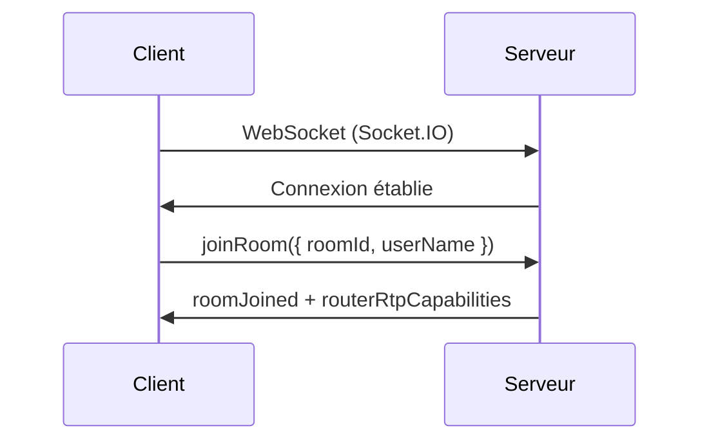
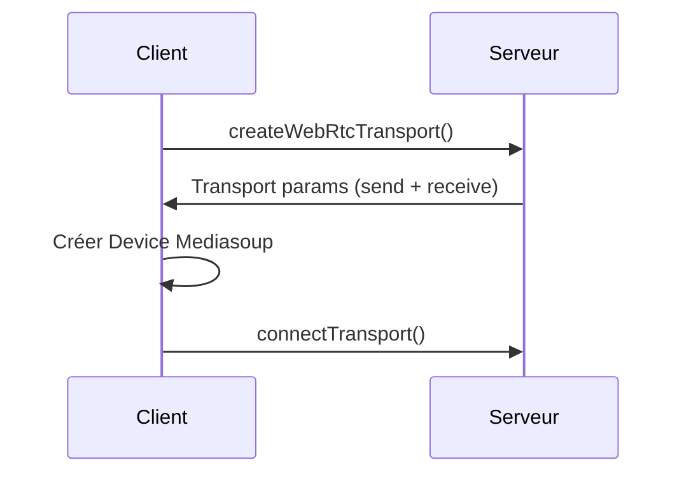
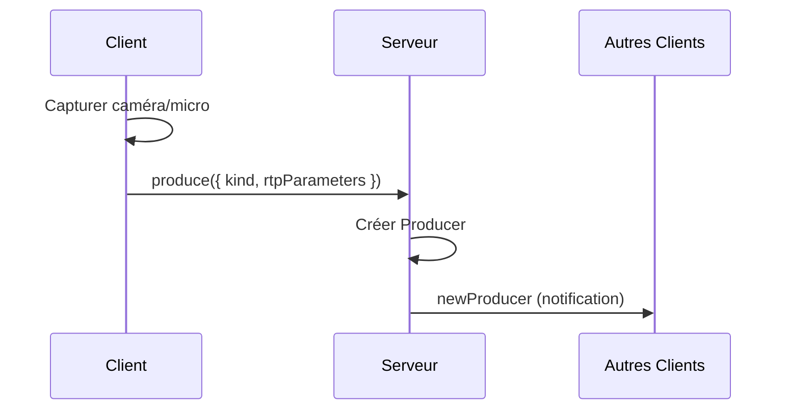
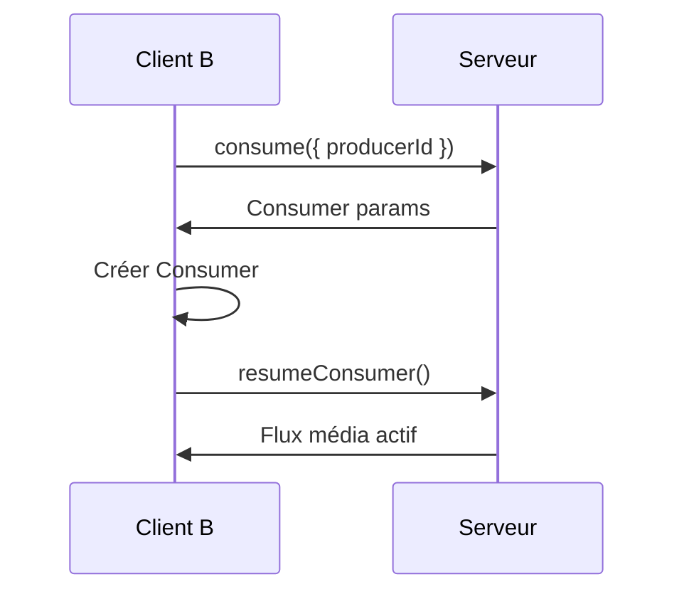

# 🏗️ Architecture

LOCAL MEET utilise une architecture **SFU (Selective Forwarding Unit)** via Mediasoup, optimisant la bande passante et les performances.

## 📊 Diagramme d'architecture

```
┌─────────────┐         WebSocket (Socket.IO)         ┌─────────────┐
│             │◄────────── Signalisation ─────────────►│             │
│   CLIENT    │                                        │   SERVEUR   │
│  (Browser)  │         WebRTC (Mediasoup)             │   Node.js   │
│             │◄────────── Flux Média ────────────────►│             │
└─────────────┘                                        └─────────────┘
      │                                                      │
      │                                                      │
      ▼                                                      ▼
┌─────────────┐                                    ┌──────────────┐
│ Mediasoup   │                                    │  Mediasoup   │
│ Client Lib  │                                    │    Router    │
└─────────────┘                                    └──────────────┘
                                                           │
                                                           ▼
                                                   ┌──────────────┐
                                                   │  Transports  │
                                                   │   WebRTC     │
                                                   └──────────────┘
```

## 🔄 Flux de communication

### 1. **Connexion et Signalisation**



### 2. **Configuration WebRTC**



### 3. **Production de média**



### 4. **Consommation de média**



## 🎯 Avantages de l'architecture SFU

| Architecture | Bande passante | CPU Client | Scalabilité | Qualité |
|--------------|----------------|------------|-------------|---------|
| **Mesh (P2P)** | Très haute | Très haute | ❌ Mauvaise (max 4-6) | Variable |
| **MCU** | Faible | Faible | ✅ Excellente | Uniforme |
| **SFU** | Moyenne | Moyenne | ✅ Excellente | ✅ Maximale |

**LOCAL MEET utilise SFU** : Le meilleur compromis entre performance, qualité et scalabilité.

---

## 🛠️ Stack Technique

### Frontend

| Technologie | Version | Description |
|-------------|---------|-------------|
| [Next.js](https://nextjs.org/) | 16.0.1 | Framework React avec SSR |
| [React](https://react.dev/) | 19.2.0 | Library UI |
| [TypeScript](https://www.typescriptlang.org/) | 5.x | Typage statique |
| [Tailwind CSS](https://tailwindcss.com/) | 4.1.17 | Framework CSS utilitaire |
| [Mediasoup Client](https://mediasoup.org/) | 3.18.0 | Client WebRTC SFU |
| [Socket.IO Client](https://socket.io/) | 4.8.1 | WebSocket client |
| [Lucide React](https://lucide.dev/) | 0.553.0 | Icônes modernes |
| [React Hook Form](https://react-hook-form.com/) | - | Gestion de formulaires |

### Backend

| Technologie | Version | Description |
|-------------|---------|-------------|
| [Node.js](https://nodejs.org/) | 20+ | Runtime JavaScript |
| [Express](https://expressjs.com/) | 4.x | Framework web |
| [Mediasoup](https://mediasoup.org/) | 3.x | SFU WebRTC serveur |
| [Socket.IO](https://socket.io/) | 4.x | WebSocket serveur |
| [Multer](https://github.com/expressjs/multer) | 1.x | Upload de fichiers |
| [HTTPS](https://nodejs.org/api/https.html) | Native | Serveur HTTPS |

### DevOps

- **SSL** : OpenSSL (certificats auto-signés)
- **Logs** : Winston (planifié)
- **Process Manager** : PM2 (recommandé)
- **Monitoring** : Prometheus (planifié)

---

## 🔒 Sécurité

### Chiffrement

- ✅ **HTTPS obligatoire** : Toutes les communications sont chiffrées
- ✅ **TLS 1.3** : Dernière version du protocole TLS
- ✅ **WebRTC DTLS** : Chiffrement end-to-end des flux média

### Certificats SSL

- Certificats auto-signés générés localement
- Clé privée 4096 bits RSA
- Validité : 365 jours
- SubjectAltName pour IP + localhost

### Données

- ❌ **Aucune donnée stockée** : Tout est en mémoire
- ❌ **Pas de tracking** : Aucun cookie, aucune analytics
- ✅ **Réseau local uniquement** : Pas d'accès externe

### Bonnes pratiques

1. **Régénérer les certificats régulièrement**
2. **Utiliser des codes de réunion complexes**
3. **Rôle admin pour contrôler les réunions**
4. **Fermer les ports sur le firewall** (sauf réseau local)

---

## ⚡ Performance

### Optimisations

- **SFU architecture** : Réduit la charge CPU et bande passante
- **Mediasoup** : Performance native (C++)
- **React Server Components** : Next.js 13+ App Router
- **Code splitting** : Chargement lazy des composants
- **WebSocket** : Communication bidirectionnelle efficace

### Benchmarks

| Métrique | Valeur | Conditions |
|----------|--------|-----------|
| Latence vidéo | < 100ms | Réseau local gigabit |
| Participants max | 12-16 | Avec partage d'écran |
| CPU serveur | ~15% | 8 participants vidéo |
| RAM serveur | ~500 MB | 8 participants vidéo |
| Bande passante | ~2-4 Mbps | Par participant (HD) |

### Recommendations

**Serveur (machine hôte)** :
- CPU : 4 cores minimum
- RAM : 4 GB minimum
- Réseau : Ethernet gigabit recommandé

**Client** :
- Navigateur moderne (Chrome, Firefox, Safari, Edge)
- Connexion : 5 Mbps minimum
